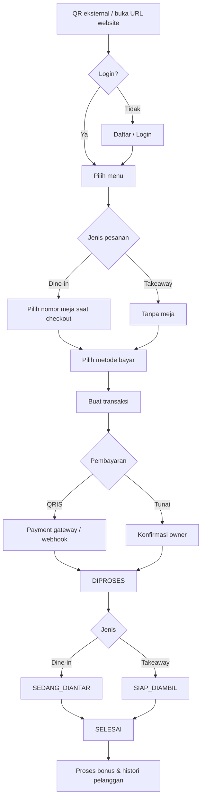

# Flowchart — Warung Maem Jadoel

## Pelanggan

```mermaid
flowchart TD
 A[QR eksternal / buka URL website] --> B{Login?}
 B -- Tidak --> C[Daftar / Login]
 B -- Ya --> D[Pilih menu]
 C --> D
 D --> E{Jenis pesanan}
 E -- Dine-in --> F[Pilih nomor meja saat checkout]
 E -- Takeaway --> G[Tanpa meja]
 F --> H[Pilih metode bayar]
 G --> H
 H --> I[Buat transaksi]
 I --> J{Pembayaran}
 J -- QRIS --> K[Payment gateway / webhook]
 J -- Tunai --> L[Konfirmasi owner]
 K --> M[DIPROSES]
 L --> M
 M --> N{Jenis}
 N -- Dine-in --> O[SEDANG_DIANTAR]
 N -- Takeaway --> P[SIAP_DIAMBIL]
 O --> Q[SELESAI]
 P --> Q
 Q --> R[Proses bonus & histori pelanggan]
```

Catatan: QR eksternal hanya shortcut ke website. Tidak ada QR/token per meja di aplikasi.
